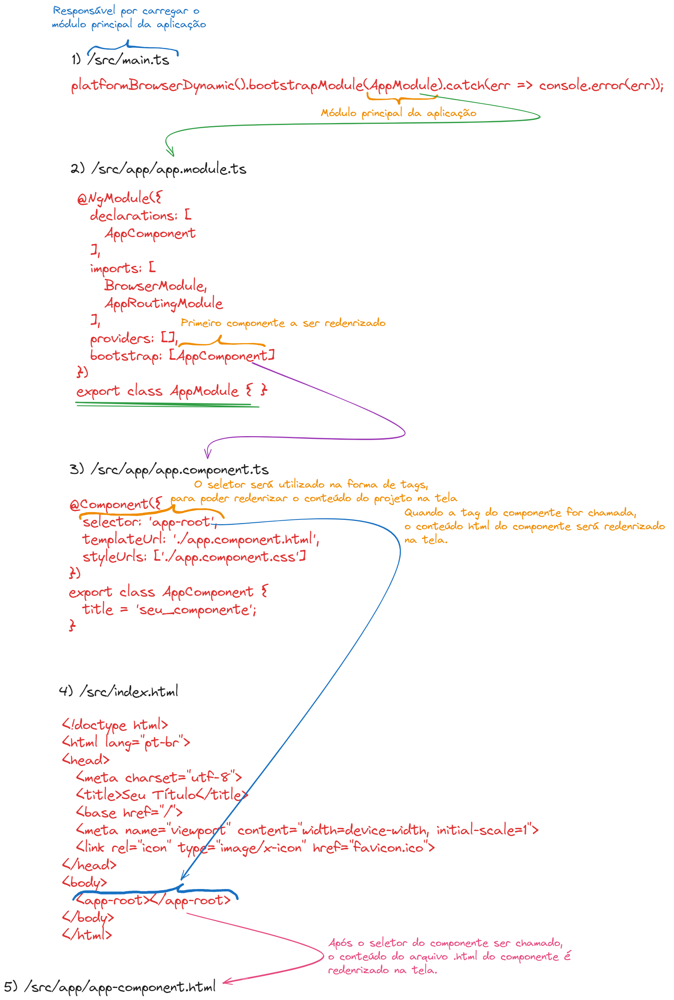

# Projeto Memoteca

Projeto criado com o intuito de aprender os conceitos iniciais da plataforma e framework Angular e ter meu primeiro contato com a ferramenta.

# Anotações Rápidas

## Angular 14: Estrutura de um Projeto Angular

### * /node_modules/

Diretório com todas as dependências do projeto.

### * /package.json

Arquivo com todas as declarações de dependências do projeto.

### * /karma.config.js

Arquivo de configuração de testes do Karma (executor de testes)

### * /angular.json

Configurações do projeto em específico (projeto que foi criado)

### * /.browserslistrc

Arquivo que contém a lista de browsers suportados pelo Angular

### * /src/

Diretório com os principais arquivos de código do projeto

### * /src/test.ts

Arquivo de configuração

### * /src/style.css

Arquivo onde incluiremos o estilo global da nossa aplicação

### * /src/polyfills.ts

Arquivo de configuração caso seja necessário dar suporte a browsers mais antigos

### * /src/environments/environment.ts

Onde iremos configurar as variáveis de ambiente de desenvolvimento

### * /src/environmnets/environment.prod.ts

Onde iremos configurar as variáveis de ambiente de produção

### * /src/assets/

Diretório onde podemos incluir imagens

### * /src/main.ts

Arquivo de entrada/iniciação da aplicação

### * /src/index.html

Página única da SPA do projeto

### * /src/app/

Diretório que possui o componente padrão do projeto, gerado no momento em que todo projeto Angular é criado.

## Componentes no Angular

No Angular, todo componente é formado por um arquivo .html, .css, .ts e .spec.ts.

O componente padrão do Angular, o app component, é composto pelos seguintes arquivos:

### * Um arquivo .css (app.component.css)

Arquivo responsável pela configuração do estilo (CSS) do componente.

### * Um arquivo .html (app.component.html)

Também chamado de template é o responsável por redenrizar o conteúdo na tela.

### * Um arquivo de especificação (app.component.spec.ts)

Arquivo utilizado para o desenvolvimento de testes unitários.

### * Um arquivo .ts (app.component.ts)

Arquivo que é o componente do projeto.

### * Arquivo de rotas do projeto (app.routing.modules.ts)

Arquivo onde configuramos todas as rotas da nossa aplicação.

### * Um arquivo módulo (app.module.ts)

Um módulo é onde organizamos de forma lógica nossa aplicação. Nessa classe existem configurações tais como:

* O decorator **@NgModule()** que possui:
    * As **declarations**, onde incluimos todos os componentes do projeto, além de outras diretivas, como arquivos e pipes que estão contidos no seu módulo.

    * Os **imports**, Incluimos os importes da nossa aplicação ou de bibliotecas utilizadas.

    * Os **providers**, onde geralmente declaramos as classes de serviços.

    * A propriedade **bootstrap**,que indica qual componente será primeiramente redenrizado na nossa aplicação.

    * **export**: Todos os componentes, diretivas e pipes que queremos exportar para fora do módulo, para que sejam visíveis por outros módulos.

# Fluxo de Execução de Um Projeto Angular (Observações Resumida)

# Comandos Angular Iniciais

* **ng new nome-do-projeto**: Cria o projeto no diretório atual.

* **ng serve**: Inicia a aplicação.

* **ng generate component nome-do-componente**: Gera um componente novo no projeto.
* **ng g c nome-do-componente**: generate component abreviado.

# Referências

[Documentação Angular.](https://angular.io/docs)